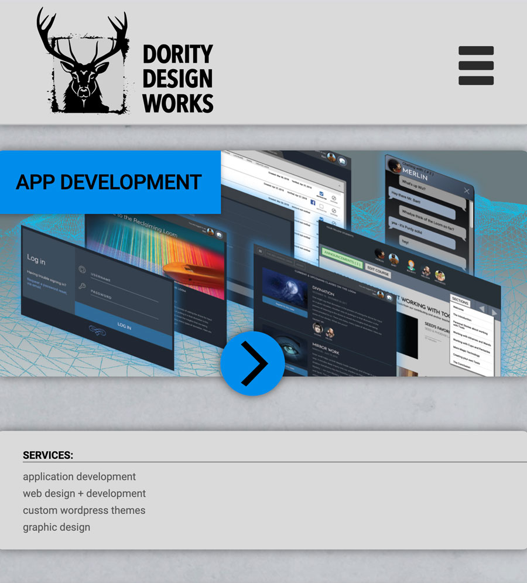

# DDWorks.org
This is the 4th generation of the DDWorks.org website.


# Table of contents
1. [Installation](#Installation)
2. [Usage](#Usage)
3. [Live Demo](#Live_Demo)
4. [License](#License)
5. [Features](#Features)
6. [Technology](#Technology)
7. [Credits](#Credits)
8. [User Story](#User_Story)
9. [Business Context](#Business_Context)
<a name="Installation"></a>
## Installation
```sh
setup an apache server running php - Mamp is the easiest
```
<a name="Usage"></a>
## Usage
```sh
view index.php in a browser
```
<a name="Live_Demo"></a>
## Live Demo
ddworks.org
<a name='License'></a>
## License
[](https://lbesson.mit-license.org/)
<a name="Features"></a>
## Features
1. slideshows
2.  responsive layout
3.  contact form
<a name="Technology"></a>
## Technology
1. PHP
2.  Javascript
3.  JQuery
4.  Include.js
<a name="Credits"></a>
## Credits
Bart Dority

**on github:** <a href='github.com/b0rgBart3'>b0rgBart3</a>

[](https://github.com/remarkablemark)

Email: borgBart3@gmail.com
<a name="User_Story"></a>
## User Story
```sh
As a prospective client I want to know more about DDWorks.org's offerings.
```
<a name="Business_Context"></a>
## Business Context
This is a portfolio website.
